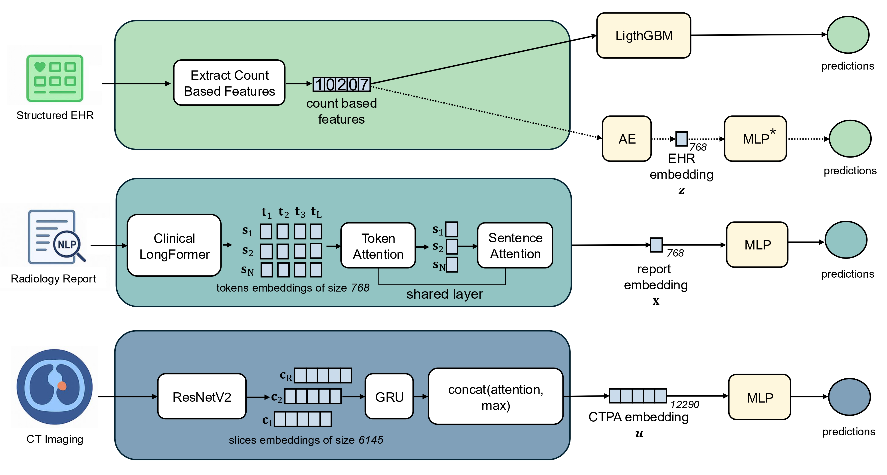
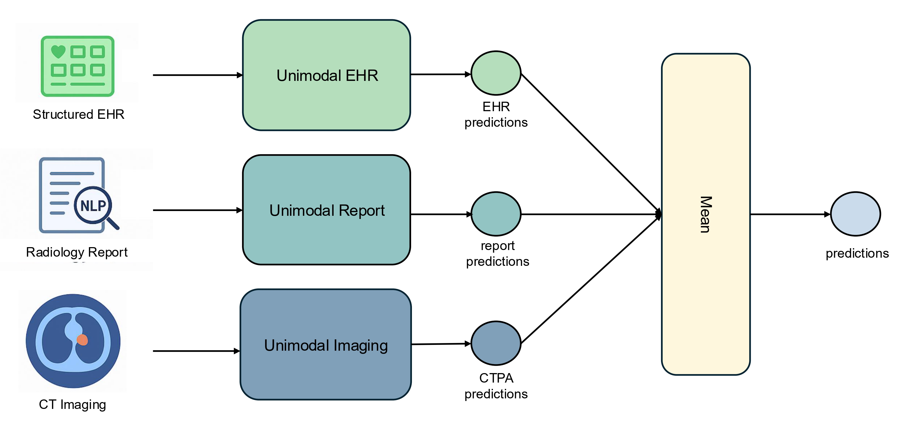
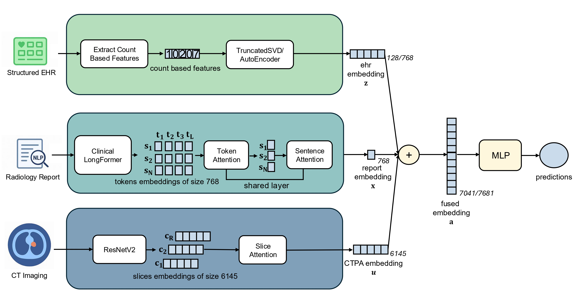
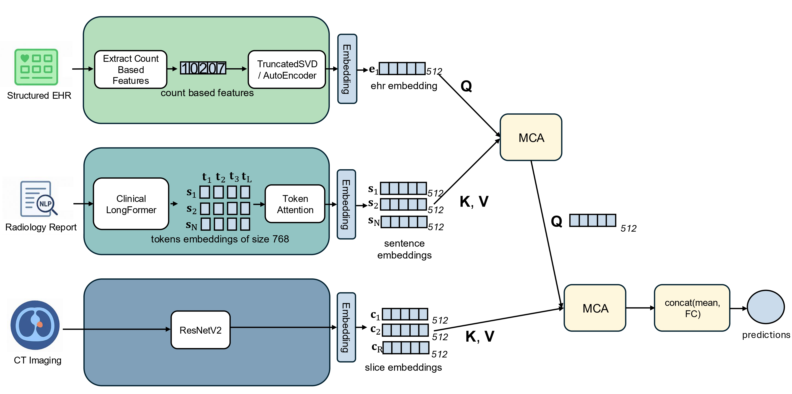

# INSPECT-CS
This is a code implemention of the framework proposed in the paper "Multimodal Clinical Data Integration for Prognosis of Pulmonary Embolism: A Comparative Study".

[](https://opensource.org/licenses/MIT)  
[](https://www.researchgate.net/publication/403120230_Multimodal_Clinical_Data_Integration_for_Prognosis_of_Pulmonary_Embolism_A_Comparative_Study)

## 📌 Overview
This repository contains the official implementation of the paper:

**"Multimodal Clinical Data Integration for Prognosis of Pulmonary Embolism: A Comparative Study"**  
Authors: Domenico Paolo, Paolo Soda,
Matteo Tortora, Alessandro Bria, Rosa Sicilia.

We combine structured EHR data, clinical notes, and imaging features to improve risk prediction performance.

---

## ⚙️ Installation
```bash
git clone https://github.com/nico9902/INSPECT-CS.git
cd INSPECT-CS
pip install -r requirements.txt
```
---

## 🚀 Usage

The project is modular: you can train unimodal models (EHR-only, Report-only) or multimodal fusion models. We use Hydra, so you can override any parameter directly from the command line.

* **Unimodal Reports:**

Extract Clinical Long-former features from reports:
  
```
python src/reports/run_featurize.py
```

Run mortality prediction task:

```
python src/reports/run_classify.py task=1_month_mortality exp_name=reports_run_0 seed=42
```

* **Unimodal Image:**

Extract ResNetV2 features from images:
  
```
python src/image/run_featurize.py
```

Run mortality prediction task:

```
python src/image/run_classify.py model=model_1d dataset=stanford_featurized \
    dataset.csv_path=/mimer/NOBACKUP/groups/naiss2023-6-336/multimodal_os/PE-Insight/data/folds/unimodal_image/1_month_mortality.csv \
    dataset.target=1_month_mortality \
    dataset.pretrain_args.model_type=resnetv2_101_ct \
    dataset.pretrain_args.channel_type=window \
    dataset.feature_size=768 \
    dataset.num_slices=250 \
    model.aggregation=attention+max \
    model.seq_encoder.rnn_type=GRU \
    model.seq_encoder.bidirectional=true \
    model.seq_encoder.num_layers=1 \
    model.seq_encoder.hidden_size=128 \
    model.seq_encoder.dropout_prob=0.25 \
    dataset.weighted_sample=true \
    trainer.max_epochs=50 \
    lr=0.001 \
    trainer.seed=$seed \
    n_gpus=$n_gpus \
    trainer.strategy=ddp \
    dataset.batch_size=128 \
    trainer.num_workers=1 \
    dataset.num_slices=250 
```

* **Unimodal EHR-GBM:**

Extract labels and features:
  
```
python src/ehr/1_csv_to_database.py --path_to_input /data/ehr/omop --path_to_target /data/ehr/output/inspect_femr_extract --athena_download /data/ehr/athena/ontology.pkl --num_threads 4

python src/ehr/2_generate_labels_and_features.py --path_to_cohort /data/cohort_0.2.0_master_file_anon.csv --path_to_database /data/ehr/output/inspect_femr_extract --path_to_output_dir /data/ehr/output/labels_and_features/1_month_mortality --labeling_function 1_month_mortality --num_threads 4

python src/ehr/filter_labeled_patients.py
```

Run mortality prediction task:

```
python 3_train_gbm.py --path_to_cohort /data/ehr/output/labels_and_features/1_month_mortality/filtered_cohort.csv --path_to_database /data/ehr/output/inspect_femr_extract --path_to_output_dir /data/ehr/output/labels_and_features/gbm_models --path_to_label_features /data/ehr/output/labels_and_features/1_month_mortality --num_threads 20
```

Do TruncatedSVD:
```
python TruncatedSVD.py
```

* **Unimodal EHR-AE:**

Run mortality prediction task:

```
python src/ehr/run_classify.py
```

* **Late Fusion:**

Run mortality prediction task:

```
python src/late/average_probs.py
```

* **Early Fusion:**

Run mortality prediction task:

```
python src/multi/run_classify.py \
    task=1_month_mortality \
    exp_name=1_month_mortality_early_ehr1_image_report_0 \
    dataset.target=1_month_mortality \
    data.weighted_sample=true \
    trainer.epochs=50 \
    trainer.learning_rate=0.001 \
    trainer.alpha=0.0 \
    seed=0 \
    trainer.n_gpus=1 \
    trainer.strategy=ddp \
    trainer.batch_size=128 \
    model.fusion.add_contrast=false \
    model.name=early \
    dataset.num_slices=250 \
    model.fusion.fusion_method=concat \
    modalities="['image', 'report', 'ehr']"\
    model.ehr_size=128 \
```

* **Cross Fusion:**

Run mortality prediction task:

```
python src/multi/run_classify.py \
    task=1_month_mortality \
    exp_name=1_month_mortality_cross_ehr1_image_report_0 \
    dataset.target=1_month_mortality \
    data.weighted_sample=true \
    trainer.epochs=50 \
    trainer.learning_rate=0.001 \
    trainer.alpha=0.5 \
    seed=0 \
    trainer.n_gpus=1 \
    trainer.strategy=ddp \
    trainer.batch_size=128 \
    model.fusion.add_contrast=true \
    model.name=cross \
    dataset.num_slices=250 \
    model.fusion.fusion_method=concat \
    modalities="['report', 'image', 'ehr']" \
    model.ehr_size=128 \
```

* **Armour Fusion:**

Run mortality prediction task:

```
python src/multi/run_classify.py \
    task=1_month_mortality \
    exp_name=1_month_mortality_armour_ehr1_image_report_0 \
    dataset.target=1_month_mortality \
    data.weighted_sample=true \
    trainer.epochs=50 \
    trainer.learning_rate=0.001 \
    trainer.alpha=0.5 \
    seed=0 \
    trainer.n_gpus=1 \
    trainer.strategy=ddp \
    trainer.batch_size=128 \
    model.fusion.add_contrast=true \
    model.name=armour \
    dataset.num_slices=250 \
    model.fusion.fusion_method=concat \
    modalities="['report', 'image', 'ehr']" \
    model.ehr_size=128 \
```

---

## 🏗 Model Architecture
The framework integrates three distinct clinical data modalities using specialized encoders and various fusion strategies to optimize prognostic accuracy.

### Modality Encoders
* **CT Imaging:** Slices are processed using a **ResNetV2-101** backbone (pretrained with BigTransfer). Slice-level features are aggregated via **bidirectional GRU** and a **Hybrid Attention-and-Max Pooling** mechanism.
* **Radiology Reports:** Encoded using **Clinical-Longformer** to handle long-form clinical text. It employs a **two-level hierarchical attention mechanism** (token-level and sentence-level) to generate a 768-dimensional report embedding.
* **Structured EHR:** Processed through a **Supervised Autoencoder (EHR-AE)** with two layers to learn task-adaptive representations. For tree-based baselines, a **LightGBM** model is also supported.


### Fusion Strategies
1.  **Late Fusion (MEAN):** A robust strategy that averages the predicted probabilities from independent unimodal models. This approach demonstrated the most stable and highest performance (MCC) across different time horizons.
   
3.  **Early Fusion:** Features from all three modalities are concatenated into a single vector before being passed to a Multi-Layer Perceptron (MLP) classifier.
   
5.  **Intermediate Fusion:**
    * **ARMOUR:** Employs cross-attention and contrastive alignment to ensure robustness against missing modalities.
      
    * **CROSS:** Uses a hierarchy of Multi-Head Cross-Attention (MHCA) blocks to model complex inter-modality interactions.ù
      

---

## 📊 Dataset & Preprocessing

The study utilizes the **INSPECT dataset**, the first large-scale, public multimodal cohort for PE.

### Dataset Statistics
* **Scope:** 23,248 CTPA studies from 19,402 unique patients.
* **Targets:** All-cause mortality at 1-month, 6-month, and 12-month intervals.
* **Splitting:** Strict patient-level splits (train/val/test) are implemented to prevent data leakage.

### Preprocessing Pipelines
* **CT Imaging:**
    * Intensity values converted to **Hounsfield Units (HU)**.
    * Three standard clinical windows (**Lung, PE, and Mediastinum**) are applied and stacked into 3-channel images.
    * Slices are resized to 256×256 and center-cropped to **224×224**.
* **Radiology Reports:**
    * Text is segmented into sentences using a custom clinical-aware algorithm.
    * Tokenization is performed using the **Clinical-Longformer** tokenizer.
* **Structured EHR:**
    * Data represented as a sparse count matrix of clinical codes (ICD-10, Labs, Medications) prior to the scan date.
    * Dimensionality is reduced using **Truncated SVD (TSVD)** to 128 dimensions or via the task-specific **Supervised Autoencoder**.

---

## 🔢 Results

Our experiments evaluate the prognostic performance across three time horizons: **1-month**, **6-month**, and **12-month mortality**. The project compares unimodal baselines against various fusion strategies.

### 1. Performance Summary
The table below illustrates the predictive performance (Mean ± SD) across 5-fold cross-validation.

The following table compares the performance of our best unimodal baselines against different multimodal fusion architectures.

| Model Category | Configuration | 1-Month MCC | 6-Month MCC | 12-Month MCC |
| :--- | :--- | :---: | :---: | :---: |
| **Unimodal** | **Best Unimodal Baseline** | 0.269 ± .013 | 0.367 ± .072 | 0.454 ± .023 |
| **Early Fusion** | EHR-TSVD, Report, Image | 0.293 ± .009 | 0.393 ± .008 | 0.426 ± .008 |
| | EHR-AE, Report, Image | 0.302 ± .008 | 0.378 ± .014 | 0.398 ± .007 |
| **Late Fusion** | Reports, EHR-GBM | **0.399 ± .050** | 0.472 ± .011 | 0.494 ± .008 |
| | Image, EHR-GBM | 0.374 ± .025 | 0.467 ± .031 | **0.497 ± .011** |
| | Reports, Image, EHR-GBM | 0.362 ± .016 | **0.479 ± .011** | 0.488 ± .002 |
| **Armour Fusion** | EHR-AE, Image, Report | 0.284 ± .023 | 0.372 ± .015 | 0.420 ± .012 |

### 2. Key Insights
* **Multimodal Advantage:** Integrating radiology reports with structured EHR data consistently improves the Matthews Correlation Coefficient (MCC), especially in long-term prognosis (12 months).
* **Fusion Impact:** Late fusion strategies (averaging predictions) often yield more stable results compared to early concatenation in high-dimensional sparse EHR settings.
* **Task Sensitivity:** Models tend to show higher precision for short-term (1-month) mortality, likely due to the higher density of relevant clinical features near the index event.

---

## 🎓 Citation

If you use this code, please cite our work:
```
@article{paolomultimodal,
  title={Multimodal Clinical Data Integration for Prognosis of Pulmonary Embolism: A Comparative Study},
  author={Paolo, Domenico and Soda, Paolo and Tortora, Matteo and Bria, Alessandro and Sicilia, Rosa}
}
```
---

## 📜 License

This project is licensed. Please review the [LICENSE](LICENSE) file for more information.
