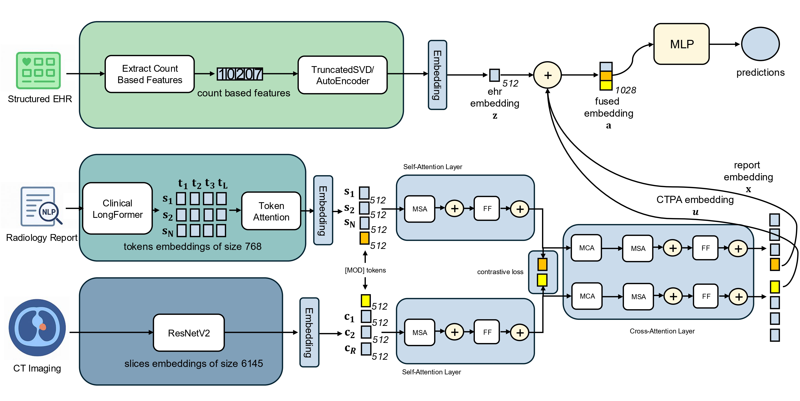

# INSPECT-CS
This is a code implemention of the framework proposed in the paper "Multimodal Clinical Data Integration for Prognosis of Pulmonary Embolism: A Comparative Study".

[](https://opensource.org/licenses/MIT)  
[](https://www.researchgate.net/publication/403120230_Multimodal_Clinical_Data_Integration_for_Prognosis_of_Pulmonary_Embolism_A_Comparative_Study)

## 📌 Overview
This repository contains the official implementation of the paper:

**"Multimodal Clinical Data Integration for Prognosis of Pulmonary Embolism: A Comparative Study"**  
Authors: Domenico Paolo, Paolo Soda,
Matteo Tortora, Alessandro Bria, Rosa Sicilia.

We combine structured EHR data, clinical notes, and imaging features to improve risk prediction performance.

---

## ⚙️ Installation
```bash
git clone https://github.com/nico9902/INSPECT-CS.git
cd INSPECT-CS
pip install -r requirements.txt
```
---

## 🚀 Usage
```
python train.py
```
---

## 🏗 Model Architecture
The framework integrates three distinct clinical data modalities using specialized encoders and various fusion strategies to optimize prognostic accuracy.

### Modality Encoders
* **CT Imaging:** Slices are processed using a **ResNetV2-101** backbone (pretrained with BigTransfer). Slice-level features are aggregated via **bidirectional GRU** and a **Hybrid Attention-and-Max Pooling** mechanism.
* **Radiology Reports:** Encoded using **Clinical-Longformer** to handle long-form clinical text. It employs a **two-level hierarchical attention mechanism** (token-level and sentence-level) to generate a 768-dimensional report embedding.
* **Structured EHR:** Processed through a **Supervised Autoencoder (EHR-AE)** with two layers to learn task-adaptive representations. For tree-based baselines, a **LightGBM** model is also supported.


### Fusion Strategies
1.  **Late Fusion (MEAN):** A robust strategy that averages the predicted probabilities from independent unimodal models. This approach demonstrated the most stable and highest performance (MCC) across different time horizons.
   
3.  **Early Fusion:** Features from all three modalities are concatenated into a single vector before being passed to a Multi-Layer Perceptron (MLP) classifier.
   
5.  **Intermediate Fusion:**
    * **ARMOUR:** Employs cross-attention and contrastive alignment to ensure robustness against missing modalities.
      
    * **CROSS:** Uses a hierarchy of Multi-Head Cross-Attention (MHCA) blocks to model complex inter-modality interactions.ù
      

---

## 📊 Dataset & Preprocessing
The model was validated on the public **INSPECT** dataset.

### Preprocessing Pipeline:
* **Resampling**: Voxel spacing standardized to $1 \times 1 \times 3$ mm.
* **Lung Masking**: Slices are filtered based on lung area (threshold > 2%) using a U-Net segmenter.
* **HU Clipping**: Hounsfield Units clipped to $[-1000, 400]$ range.
* **Normalization**: Min-Max scaling and resizing to $224 \times 224$ pixels.


---

## 🎓 Citation

If you use this code, please cite our work:
```
@article{paolomultimodal,
  title={Multimodal Clinical Data Integration for Prognosis of Pulmonary Embolism: A Comparative Study},
  author={Paolo, Domenico and Soda, Paolo and Tortora, Matteo and Bria, Alessandro and Sicilia, Rosa}
}
```
---

## 📜 License

This project is licensed. Please review the [LICENSE](LICENSE) file for more information.
